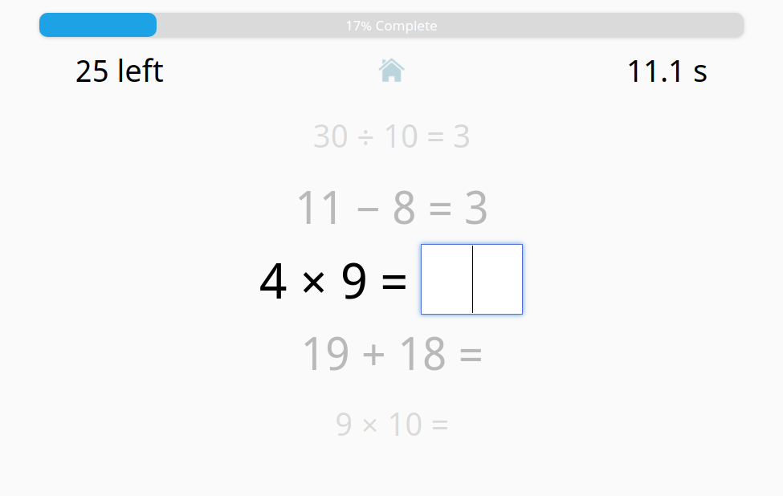

**Note: This updated rewrite of So Many Numbers is incomplete.**

Please use the [current production version](https://so-many-numbers.github.io) in the meantime.

<p align="center">
 
</p>

<p align="center">
<a href="#"><strong>Game URL</strong></a>
</p>

<p align="center">
 
</p>

***
**Works on smartphones, tablets, and desktop devices**


Your goal in So Many Numbers is to solve 30 math problems as fast as you can. You can fine-tune the game to a chosen difficulty (simple or standard) and set of operators (+, −, ×, and ÷).

So Many Numbers is designed for those of all ages. It helps children and adults sharpen their mental math skills and offers a competitive challenge for enthusiasts alike!

## About the Project

Ashley Caswell and I (Timothy Hsu) created So Many Numbers during the Make School Summer Academy 2018 hackathon. After Make School, I continued to develop the game to what you see now. You can view the old repository [here](https://github.com/So-Many-Numbers/So-Many-Numbers.github.io).

So Many Numbers marks my first Web project to utilize a JavaScript framework (Vue), after rewriting the game in September 2019.

## Building the Game

You may desire to run So Many Numbers locally to see how the game works and/or mod the game with your own features.

If you're new to building sites with frameworks (like I was), [here's how I set up my development environment](https://github.com/TimTree/so-many-numbers/wiki/Preparing-the-Development-Environment).

Otherwise, you know the drill:

Install dependencies
```
npm install
```

Run the game in a development server
```
npm run serve
```

Compile the game for production
```
npm run build
```

## Bug Reports and Feedback

You can submit bug reports/feature requests to [GitHub Issues](https://github.com/TimTree/so-many-numbers/issues) and general feedback as a comment on the [blog's project page](https://www.gamesbytim.com/2018/09/so-many-numbers-30-problem-arithmetic.html).

(You can also report bugs on the blog, but I'm more receptive to GitHub Issues in this case.)

## License

So Many Numbers is licensed under the MIT License.

***
*Created by Ashley Caswell and Timothy Hsu*